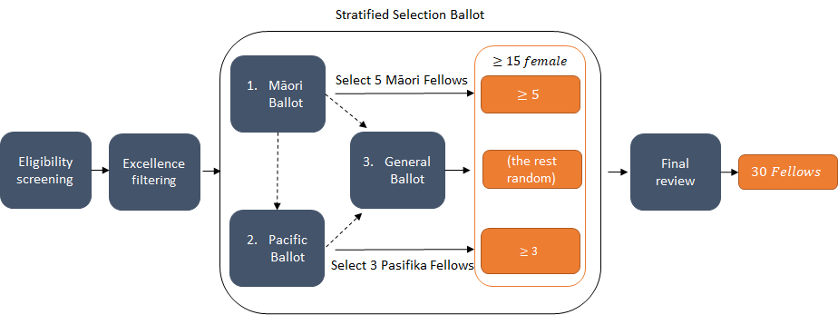

# Selection Process for the MBIE Science Whitinga Fellowship

To accomplish diversity in the MBIE Science Whitinga Fellowship selection process, the selection will utilise a stratified ballot system (illustrated below). 

Note: Full arrows denote the path for successful applications at each stage. Black dashed arrows denote the path for applications that have not been selected in either the Māori or Pacific Ballots and have been re-distributed into subsequent ballots.

In the first ballot five applicants are drawn who identify as Māori from the applicant pool. Next three applicants are drawn who identify as Pacific Persons, including those who may identify as both Māori and Pacific Persons. We note how many of the eight selected fellows identify as female.

In the general selection ballot, the remaining applicant pool (including any previously unselected Māori and Pasifika) is sorted randomly. We then select the top applicants identifying as female and gender diverse from this list until a total of 15 female fellows are selected. In doing so, if a gender diverse candidate is randomly listed higher than the 15th female, the cut will include both the required minimum of 15 females and the gender diverse person, making the total 16. Keeping the order constant, we then go back to the top of our list, and select the top remaining fellows (which will be predominantly males and non-responders excluded from the selection above, but could also include additional female and gender diverse candidates) until the total of thirty fellows have been drawn.

Simulations of these processes using recent PhD graduates that have contacted the Society, show that the outcomes are likely to draw more Māori, Pacific Persons, and female fellows than the minimum targets (~33% of 1000 simulated rounds select seven Māori fellows, ~25% select four Pasifika fellows, and ~50% select more than the minimum fifteen female fellows). In addition, this process ensures that the likelihood of a gender diverse candidate being selected for the fellowship is not significantly different (P>0.05 from the simulations) from the rate at which gender diverse people are likely to apply for the fellowship.

This equitable selection approach aligns with the [MBIE Diversity in Science Statement](https://www.mbie.govt.nz/assets/95e033c7bc/diversity-in-science-statement.pdf) and [Royal Society Te Apārangi’s public diversity policy](https://www.royalsociety.org.nz/who-we-are/our-goals/diversity/royal-society-te-aparangi-diversity-policy/).

This repository contains the algorithm, whitinga_selection.r, that the Society will follow to draw the 30 successfull Whitinga Fellows.